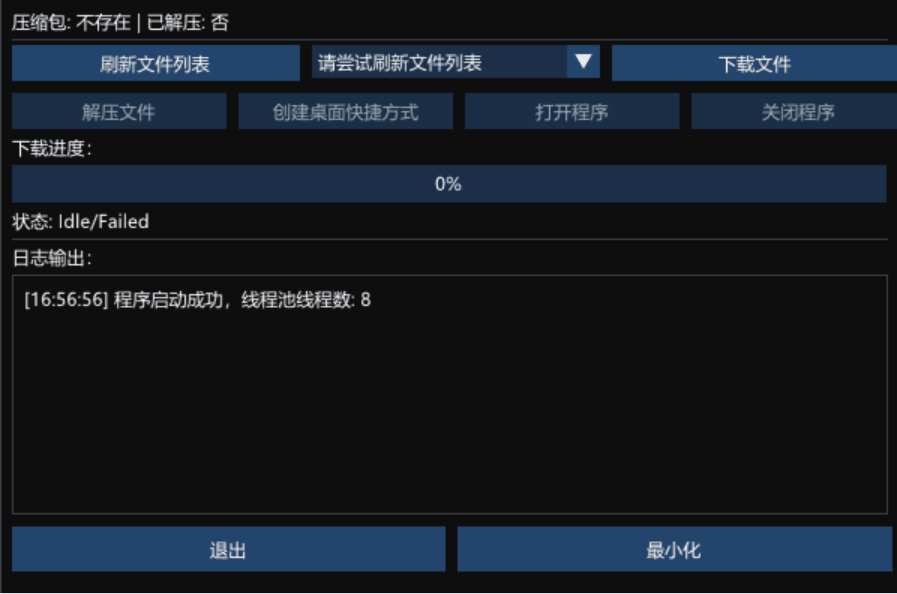

[🇨🇳 中文](README.zh-CN.md) | [🇺🇸 English](README.md)

# SeraphineDownloader

A lightweight **Win32 + DirectX11 + ImGui** framework for GUI applications with built-in file downloading and file management support.

---

## 📌 Project Overview

SeraphineDownloader provides a modular architecture for desktop GUI applications:

- **WindowManager** – Handles window creation, DirectX11 device management, and message loop.  
- **UIManager** – Initializes ImGui, manages frame rendering and GUI widgets.  
- **AppLogic** – Application logic: button states, logging, and core functionality.  
- **Downloader** – WinHTTP-based file downloader with progress bar and log callback.  
- **FileManager** – Local file management, including ZIP extraction and shortcut creation.  

This project allows users to quickly download open-source tools from GitHub, track download progress, and view real-time logs in a convenient GUI.

Example open-source projects used for testing downloads:  

- [Seraphine](https://github.com/Zzaphkiel/Seraphine)  
- [LeagueAkari](https://github.com/LeagueAkari/LeagueAkari)  
- [hh-lol-prophet](https://github.com/real-web-world/hh-lol-prophet)  
- [Frank](https://github.com/Java-S12138/frank)  

---

## 🎬 Demo

---

## ⚙️ System Requirements

- **Windows 10** or later  
- **Visual Studio 2019 / 2022**  
- **C++17** or later  
- **Windows 10 SDK** (DirectX included)

---

## 🛠️ Build Instructions

1. Open the `.sln` solution file in Visual Studio.  
2. Configure project properties:  
   - **C++ → General → Character Set** → `Use Unicode Character Set`  
   - **Linker → System → Subsystem** → `Windows (/SUBSYSTEM:WINDOWS)`  
   - Link required libraries: `d3d11.lib`, `dxgi.lib`, `d3dcompiler.lib`, `winhttp.lib`  
3. Build the project in **Debug** or **Release** mode to generate the executable.

---

## 🚀 Features & Future Directions

- Multi-file download queue  
- Resume interrupted downloads  
- Automatic extraction and installation after download  
- UI theming and internationalization support  

---

## 📄 License

MIT License – free to use, modify, and distribute.
