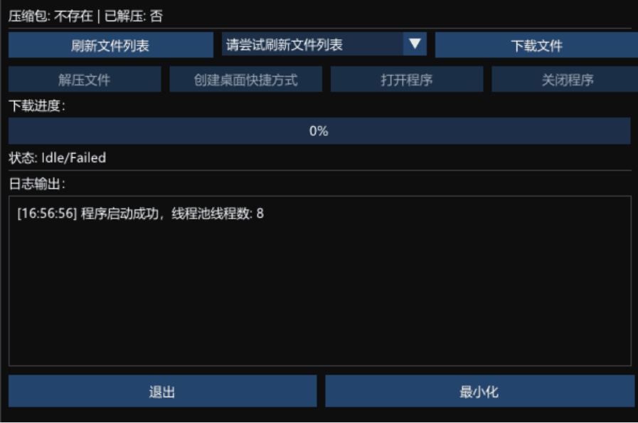

# SeraphineDownloader

一个简单的 **Win32 + DirectX11 + ImGui** 框架，用于 GUI 应用开发，内置文件下载功能。

---

## 📖 项目简介

本项目封装了以下功能模块：

- **WindowManager**：窗口创建、DirectX11 设备管理、消息循环封装  
- **UIManager**：ImGui 初始化、帧循环和渲染  
- **AppLogic**：应用逻辑（按钮状态、日志、功能处理等）  
- **Downloader**：基于 WinHTTP 的文件下载模块（支持进度条、日志回调）  
- **FileManager**：文件解压与本地处理  

应用启动后，可以一键从云端下载在 GitHub 上受欢迎的开源战绩助手，并实时显示下载进度与日志。  
参考开源项目：
- [Seraphine](https://github.com/Zzaphkiel/Seraphine)  
- [LeagueAkari](https://github.com/LeagueAkari/LeagueAkari)  
- [hh-lol-prophet](https://github.com/real-web-world/hh-lol-prophet)  
- [frank](https://github.com/Java-S12138/frank)  

---

## 🎬 演示效果

---

## ⚙️ 编译环境要求

- **Visual Studio 2019 / 2022**  
- **Windows 10 或更高**  
- **C++17** 或更高  
- **Windows 10 SDK**（包含 DirectX SDK，无需单独安装）  

---

## 🛠️ 编译方法

1. 打开项目 `.sln` 文件  
2. 确认项目属性配置：
   - **C++ → 常规 → Character Set** → `使用 Unicode 字符集`  
   - **Linker → System → Subsystem** → `Windows (/SUBSYSTEM:WINDOWS)`  
   - 链接库：`d3d11.lib`, `dxgi.lib`, `d3dcompiler.lib`, `winhttp.lib`  
3. 编译 **Debug** 或 **Release**，生成 `.exe` 文件  

---

## 🚀 功能扩展方向

- 支持多文件下载队列  
- 支持断点续传  
- 下载完成后自动解压并安装  
- UI 主题美化与国际化支持  

---

## 📄 许可证

本项目基于 MIT 协议开源，欢迎自由使用与修改。
